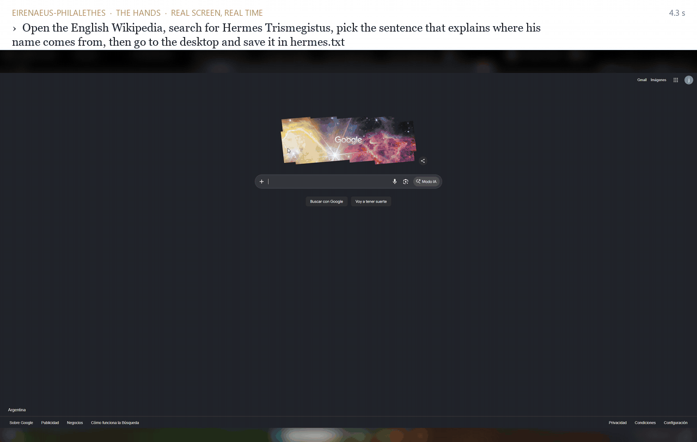

# EirenaeusPhilalethes V.1
### A compound reasoning system on a single consumer GPU: same quality as its base model, 1.5x faster

J.C. - Asastu · Buenos Aires · October 2026 · draft v0.1

**[Read the designed PDF (10 pages, figures)](WHITEPAPER.pdf)**

*The hands at work on my real screen, in real time (not sped up): one order, six steps, the sentence saved to a file on my desktop (shown at the end, read from disk). My desktop is blurred. Quality computer use in each application needs on-the-ground training (Section 8).*

---

## Abstract

EirenaeusPhilalethes V.1 (Eirenaeus) is a local compound AI system. It wraps an open 27B reasoning model with a small
decision layer that runs on the CPU, a supervisor over the model's thinking, a pair of "hands" that operate the computer,
and a verified memory. It does not change the model's weights.

On 677 problems from four public benchmarks (HumanEval+, MBPP+, AIME 2025, and a held-out mix of code and math), measured
on the same machine at temperature 0 against the same base model served alone, Eirenaeus shows **no statistically
significant difference in quality** (McNemar exact, p ≥ 0.62 on every benchmark) while being **1.51x faster in total
wall-clock time** (1.27x to 1.93x depending on the task). On tool calling (BFCL v4, 400 cases) it ties the base model
in quality but gives no speed advantage, and I report that too. It also does what the base model alone cannot: it
operates a computer and completes real tasks checked against the world.

Everything here was measured on one RTX GPU with 12 GB of VRAM. I report what worked, what did not, and the mistakes in
my own measurement that I caught along the way.

## 1. Motivation

A strong open model on a consumer GPU spends most of its time thinking. Much of that thinking is either unnecessary (the
answer was clear early) or misdirected (a simple request treated as a hard one). A system that decides *how much* to
think before thinking, and notices *when* it can stop, should save time without losing answers.

The question I set out to answer honestly: **can an orchestration layer around a fixed model make it faster without
making it worse?** Not "a better model", the same weights, a better way to use them.

## 2. Architecture

The system is named after the three alchemical principles plus the fifth essence. The names are a mnemonic, not a claim.

| Part | Role | Where it runs |
|---|---|---|
| **Mercury**: the decision layer (Laya, 421M parameters) | Reads each request in ~0.5 s and *selects*: how much to think, whether it is code, whether it needs live data, whether it is an order for the computer | CPU |
| **Sulphur**: the reasoning core (Ternary-Bonsai-2-27B, PQ2_0, served by llama.cpp) | Thinks and answers | GPU, ~10 GB VRAM, ~65 tok/s |
| **Salt**: the hands | Operate the computer: a headless browser by default, the real screen only when authorized | CPU |
| **Quintessence**: memory | Its own small store, **inspired by [Engram](https://github.com/Gentleman-Programming/engram)** (Gentleman Programming) but injected rather than searched: chosen on the CPU, no model tokens spent. Validity follows [Dokimos](https://github.com/Jc-asastu/dokimos): every memory expires and is re-attested against its source | CPU |

**Request flow.** A request arrives at an OpenAI-compatible gateway. Mercury picks a route (no thinking, brief, deep,
hard) in under a second. A supervisor watches the core's thinking stream and stops loops ("let me reconsider…" three
times) by asking for the answer with what it has. Requests whose answer *is* the reply (code, math) skip memory and are
never offered the computer. Requests that bring the client's own tools take a light path: only Mercury's effort pick and
a thinking cap.

## 3. Design principles

1. **Selection over generation.** The decision layer never writes text; it chooses among options. Choosing is cheap
   (~0.4 s on a CPU) and checkable; every escalation to the core becomes a training label.
2. **Listen, think, act.** Like a person: understand the request, think, and only then act on the computer. The hands
   are a tool the reasoning asks for, never the first move.
3. **Measure before claiming.** Every claim in this paper comes from a results file, never from a console, never from a
   single lucky run.

## 4. Evaluation methodology

- **Same machine, same harness, same questions** for both arms: Eirenaeus versus the base model served alone with the
  authors' default settings (thinking at maximum effort).
- **Temperature 0.** A single run at temperature 1.0 produced a "loss" on HumanEval+ (146 vs 156, p ≈ 0.002) that
  disappeared at temperature 0 (151 vs 154, p = 0.51). One sample per arm with randomness is not evidence.
- **Paired comparison** with McNemar's exact test on discordant items. "Better" or "worse" only below p = 0.05.
- **Held-out data.** 105 items development never used; for agentic work, a development split and a judge split that is
  run once per milestone and never tuned on.
- **The control arm.** When Eirenaeus seems to win thanks to a setting, the base model is also run with that setting.
  If the base model matches, the credit goes to the setting, not to Eirenaeus (see tool calling).
- **The GPU is not shared** during measurement; each step logs VRAM and any other GPU process.

## 5. Results

### 5.1 Reasoning: same quality, 1.51x faster

Temperature 0, RTX 12 GB, Eirenaeus v2 versus Ternary-Bonsai-2-27B alone.

| Benchmark | Items | Eirenaeus | Base alone | Only E / only base | McNemar p | Time E vs base | Speed |
|---|---|---|---|---|---|---|---|
| Held-out mix (code, GSM8K, AIME, MATH) | 105 | 97 | 98 | 1 / 2 | 1.00 | 6,604 s vs 8,561 s | 1.30x |
| MBPP+ | 378 | 308 | 309 | 7 / 8 | 1.00 | 12,227 s vs 19,228 s | 1.57x |
| AIME 2025 | 30 | 27 | 27 | 1 / 1 | 1.00 | 6,827 s vs 8,691 s | 1.27x |
| HumanEval+ | 164 | 156 | 154 | 3 / 1 | 0.62 | 5,055 s vs 9,752 s | 1.93x |
| **Total** | **677** | | | | | **30,712 s vs 46,231 s** | **1.51x** |

The gain lives in long problems. On short ones Eirenaeus carries a fixed cost of about one to two seconds per request
(median 12.3 s vs 11.2 s on the held-out mix), and wins back far more on problems where the core would otherwise think
for minutes.

### 5.2 Tool calling: a tie, and no speed advantage

BFCL v4, AST categories (simple, multiple, parallel, parallel-multiple), 100 each, official checker, temperature 0.

| Configuration | Correct / 400 | Total time | Median |
|---|---|---|---|
| Base alone, thinking (as published) | 373 | 1,589 s | 3.1 s |
| Base alone, thinking off | 371 | 877 s | 1.8 s |
| Eirenaeus, all layers | 362 (worse, p = 0.04) | 3,649 s | 5.1 s |
| Eirenaeus, light path, Mercury picks effort | **375** (tie, p = 0.75) | 2,027 s | 3.8 s |
| Eirenaeus, light path, thinking off | 368 | 1,072 s | 1.8 s |

Tool calls do not need thinking: the base model with thinking off is nearly as accurate and twice as fast. That speed
belongs to the setting, not to Eirenaeus, which adds about 0.2 s per call. With all its layers on, Eirenaeus was worse:
the date line in its prompt turned "this season" into the wrong year, a live-data note leaked into unrelated calls.
The light path fixes quality; it does not create an advantage.

### 5.3 Agentic work

The base model alone cannot operate a computer, so there is no paired comparison to report here. My agentic
evaluation, where every task is checked against the world rather than against the agent's own report, is in progress
and will be published separately once it runs on a public benchmark.

### 5.4 Vision, and the current version

Images were the one place where Eirenaeus lost clearly. The cause sat in the decision layer, not in the core: it read
only the words of a request, so an exam question with a figure looked like a short factual answer and got no thinking.

| Benchmark | Items | Eirenaeus | Base alone | Only E / only base | McNemar p | Time E vs base | Speed |
|---|---|---|---|---|---|---|---|
| MMMU-Pro set 1 · v2 | 200 | 129 | 145 | 7 / 23 | < 0.01 | 11,021 s vs 9,318 s | 0.85x |
| MMMU-Pro set 2 · v3 | 200 | 130 | 137 | 9 / 16 | 0.23 | 7,256 s vs 7,848 s | 1.08x |
| HumanEval+ · v3 | 164 | 156 | 154 | 3 / 1 | 0.62 | 5,014 s vs 9,752 s | 1.94x |
| Held-out mix · v3 | 105 | 100 | 98 | 2 / 0 | 0.50 | 6,311 s vs 8,561 s | 1.36x |

Set 2 is 200 new questions never used in development; its times count only the 188 items where no other job used the
GPU. In v3 the decision layer receives a profile of the request (how many images, whether tools are offered), a request
with images never goes to "no thinking", and an exam answer with images travels without Eirenaeus's own context. The
significant loss of set 1 becomes no significant difference, and no advantage either.

A fix that broke the speed: the first v3 removed Eirenaeus's context from every direct answer, code included, and
HumanEval+ fell to 0.66x the base model's speed (one problem: 691 s instead of 22). That context is what keeps the core's
thinking short. Limited to images, the speed came back. MBPP+ and AIME 2025 were not re-run for v3; Section 5.1 is v2.

## 6. What did not work

I report these because they are as informative as the wins.

- **A goal loop inside the planner prompt** (state the goal, check it, re-plan) changed the plans themselves: tasks that
  already worked started failing, and a goal whose only evidence was a file name reported "checked" on a wrong answer.
  A second version (goal from a separate call, content evidence only) showed no significant gain on held-out orders
  at +61% time.
- **A planner that reasons before acting** showed no gain on held-out orders at +77% time.
- **Offering the computer to a request that does not need it** created loops: the model asked to "test" its code, each
  refusal cost a new round of thinking, one problem took 47 minutes. Removing the tool removed the loop; that fix is
  most of the HumanEval+ speedup.
- **Fixing a problem that did not exist.** A single noisy run suggested a code-quality loss; I sent all code to maximum
  thinking, which cost the code speedup. The temperature-0 rerun showed there had been no loss.

## 7. Safety: the hands are denied by default

During one benchmark the agent operated my real screen (it typed into the file explorer), because the
benchmark client did not request headless mode and a generic word ("file") counted as a request for the computer.
Every benchmark now forces headless mode, and the design moves from "allowed unless filtered" to **denied unless
authorized**, through four checks: which client may use the hands at all, whether the reasoning asked for them, whether
the real screen is needed and free, and an announcement or a question before the first action. A set of requests where
the agent must *not* act has to produce zero actions on every change.

## 8. Limitations and roadmap

- One machine, one GPU class, one base model. The speedup is a property of this setup until measured elsewhere.
- The supervisor and router were developed partly on public benchmarks; the held-out mix and the judge split are the
  guard against tuning on the test, not a proof of its absence.
- Computer use needs training on the ground: the hands carry out clear orders in a browser today; quality computer
  use in a given application needs the decision layer post-trained on verified episodes in that application.
- No advantage on images: on MMMU-Pro Eirenaeus is within noise of the base model (130 against 137, Section 5.4).
- Next: early stop for code verified by running the code; the hands authorization layers; a public agentic
  benchmark; post-training the decision layer per application from verified episodes.

## 9. Reproducibility

- Hardware: one NVIDIA RTX GPU with 12 GB VRAM; consumer desktop CPU; Windows 11.
- Base model: Ternary-Bonsai-2-27B PQ2_0 (llama.cpp, 64K context, reasoning budget 36,864, temperature 0 for evaluation).
- Decision layer: Laya, 421M parameters, CPU.
- Benchmarks: HumanEval+ and MBPP+ (EvalPlus v0.2.0), AIME 2025, BFCL v4 (official AST checker), held-out mix with a
  fixed offset so development never saw it.
- Every number in this paper comes from a per-item results file (id, pass, seconds, route), available on request.

## Acknowledgements

Memory inspired by [Engram](https://github.com/Gentleman-Programming/engram) by Gentleman Programming; validity rules
after [Dokimos](https://github.com/Jc-asastu/dokimos).
